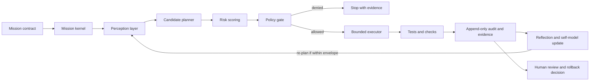
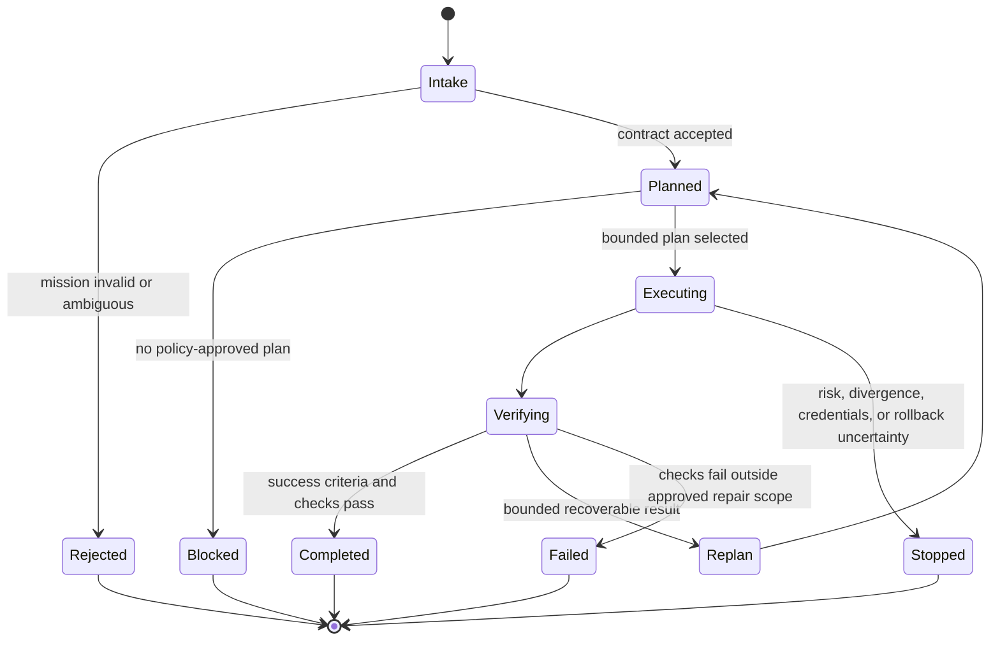
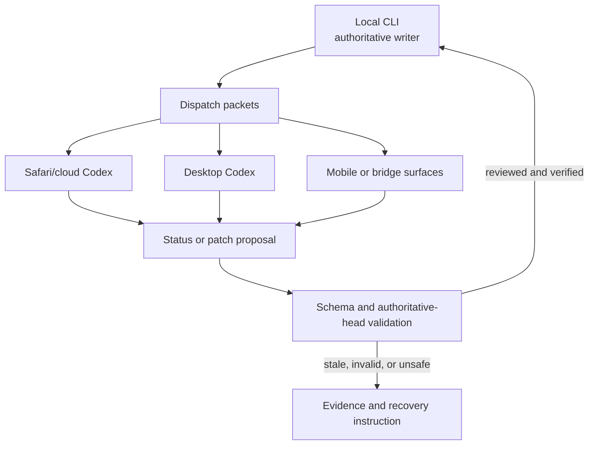

# Autonomous vNext Project Guide

Repository `0` contains a constrained, auditable builder-agent architecture. It converts an explicit mission contract into bounded planning, policy evaluation, reversible checks, evidence records, reflection, and human-reviewable reports.

> **Current maturity:** implemented Phase-0 scaffold, but no release is ready. The repository-health baseline, reproducible test/security evidence, documentation verification, provenance bundle, and candidate acceptance criteria remain incomplete.

## Product boundary

Autonomous vNext is intended to:

- validate a mission's objective, constraints, success criteria, and approval policy;
- observe repository state and uncertainty;
- generate low-risk candidate plans;
- deny actions outside the approved envelope;
- run bounded checks and scoped changes;
- append structured action and evidence records;
- stop when ambiguity, risk, divergence, or rollback uncertainty exceeds policy.

It is not intended to:

- discover or use credentials autonomously;
- perform silent remote writes, publishing, deployment, or deletion;
- modify itself outside an explicit mission scope;
- conceal failures or overwrite audit history;
- represent tensor-network modeling as physical quantum computation.

## Architecture



The cognitive Hilbert and tensor components provide deterministic state and scoring abstractions. ITensor is optional and capability-gated; normal deterministic planning remains separate from any optional backend.

## Core contracts

| Contract | Purpose | Safety property |
|---|---|---|
| `mission_contract.schema.json` | Defines objective, repository, constraints, success criteria, and approval policy | Prevents the executor from inventing mission authority |
| `action_record.schema.json` | Records consequential actions and results | Preserves append-only traceability |
| Policy evaluator | Matches commands and paths against allowlists | Deny by default |
| Planner and risk scorer | Orders viable plans by bounded risk | Prefer the lowest-risk reversible path |
| Executor | Performs only policy-approved checks/actions | Stops on missing approval, divergence, or unclear rollback |
| Evidence and experience memory | Persists reports and prior outcomes | Makes learning attributable rather than hidden |
| Federation layer | Exchanges status and patch proposals between surfaces | Keeps local CLI as authoritative integrator and validates proposed patches before application |

## State and control flow



## Repository map

- `autonomous_vnext/`: policy, planning, execution, cognitive state, memory, reflection, and federation primitives.
- `scripts/`: reproducible operator workflows, federation status, patch validation, relay evidence, dashboards, and handoffs.
- `FederationInbox/`: tracked status and proposal inputs from Codex surfaces.
- `FederationDispatch/`: locally generated routing instructions.
- `FederationRelay/`: browser/app contact evidence and target configuration.
- `FederationPatches/`: advisory patch exchange.
- `tests/`: deterministic runtime and integration checks.
- `reports/` and `state/`: generated evidence and runtime state; tracked/ignored policy must remain explicit.

## Developer onboarding

### Prerequisites

- Python 3 supported by the repository's current test environment;
- a clean checkout with no unreviewed generated artifacts;
- optional ITensor bindings only when testing the gated adapter path;
- macOS/Safari only for the corresponding desktop/browser relay scripts.

### Baseline commands

```bash
pytest -q
python3 -m autonomous_vnext.cognitive_runtime "safe tensor evidence mission"
python3 scripts/emit_codex_federation_status.py --pretty
python3 scripts/verify_patch_proposals.py \
  --authoritative-head "$(git rev-parse HEAD)" \
  --pretty
```

These commands are entry points, not release evidence by themselves. A baseline report must record the exact environment, dependency versions, commands, exit codes, outputs, and candidate commit.

### Change workflow

1. Select one `READY` task and decompose it into named files, checks, constraints, and rollback steps.
2. Confirm the mission contract and policy allow the intended actions.
3. Make the smallest reversible patch.
4. Run targeted tests followed by the complete suite and smoke checks.
5. Record generated artifacts, hashes, commands, tool versions, and residual risks.
6. Use the patch-proposal validator before applying changes from non-authoritative surfaces.
7. Stop rather than widening scope when failures are unrelated or rollback is unclear.

## Federation authority model



Remote surfaces propose; the local authoritative integrator validates and applies. Stale commit references, missing packets, target drift, and failed relay evidence must remain visible.

## Release gates

No release is ready until:

- P0 repository-health phases are completed and tied to commits;
- build, formatting, lint, type/configuration checks, full tests, and smoke tests are reproducible;
- dependency, secret, workflow-permission, and unsafe-boundary checks pass;
- README and onboarding commands work from a clean environment;
- license and public-notice requirements are resolved;
- provenance records commit, environment, tool versions, commands, timestamps, artifact hashes, and repository URL;
- the release candidate includes baseline, test, security, checksum, and rollback artifacts.

## Rollback criteria

Withdraw or roll back when verification is not reproducible, a severe security finding remains, documentation cannot reproduce the smoke test, a federation proposal bypasses validation, generated artifact hashes differ, or a change exceeds the mission contract. Preserve the failed evidence and restore the last reviewed commit or verified tag.

## Documentation map

- [Architecture, guardrails, and implemented artifacts](../AUTONOMOUS_VNEXT.md)
- [Root operator guide](../README.md)
- [Task chain](../taskchain.md)
- [Punch list](../punchlist.md)
- [Release plan](../release.md)
- [Changelog](../changelog.md)
