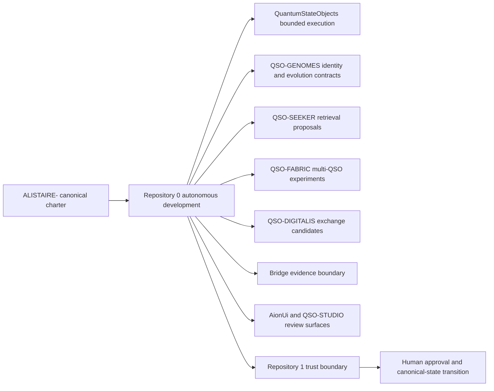
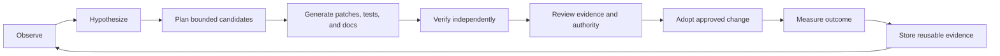

# A.L.I.S.T.A.I.R.E. portfolio role

## Designation

Repository `0` is the autonomous engineering and proposal layer for A.L.I.S.T.A.I.R.E. It owns bounded mission execution primitives, development-loop evidence, local proposal preparation, federation handoff, and reusable controls for planning and verification. It should accelerate the system by making more work reviewable in parallel, not by absorbing every subsystem or becoming the sole authority over all repositories.

## Responsibility map

The arrows represent proposed work, contracts, fixtures, and evidence—not unilateral control.

## Repository ownership boundaries

| Concern | Preferred owner | Repository `0` role |
|---|---|---|
| Canonical mission, values, and ecosystem doctrine | `ALISTAIRE-` | implement bounded engineering workflows consistent with the charter |
| Autonomous engineering orchestration | Repository `0` | primary owner, subject to approved capabilities and external approval gates |
| Canonical state and credential boundary | Repository `1` or an approved dedicated trust service | submit validated proposals; never self-issue unrestricted authority |
| QSO runtime semantics | `QuantumStateObjects` and approved kernel owner | generate tests, adapters, and evidence without redefining contracts silently |
| Genome identity and compatibility | `QSO-GENOMES` | consume versioned schemas and propose migrations |
| Retrieval and hostile-input isolation | `QSO-SEEKER` | request evidence and respect consent/security envelopes |
| Multi-QSO experiment fabric | `QSO-FABRIC` | schedule bounded experiments and evaluate artifacts |
| Cross-system evidence publication | `Bridge` | produce request/evidence packets; publication authority remains separate |
| Human review interface | `AionUi` and `QSO-STUDIO` | expose plans, uncertainty, evidence, and approval requirements |
| Economic intent | `QSO-PAYMENTS` | propose resource intents only; no unilateral payment authority |

## Autonomous-development control plane

Repository `0` is the strongest current candidate to own development orchestration because it already contains mission, policy, executor, audit, federation, evidence, and portfolio-health primitives. That ownership should be formally bounded by an architecture decision defining:

- repositories that opt in;
- readable and writable paths;
- branch and pull-request rules;
- capability issuance and revocation;
- exact-head evidence requirements;
- merge, release, and deployment approvals;
- emergency stop and incident ownership;
- retry, replay, and idempotency behavior;
- cross-repository rollback and schema-migration rules.

Until that decision is accepted, owner-wide scanning, issue mutation, Terraform apply, release, deployment, and credential use remain proposals or human-triggered operations.

## Evolution doctrine

A.L.I.S.T.A.I.R.E. should progress faster through a compounding evidence loop:

Acceleration comes from reusing validated fixtures, contracts, documentation components, test harnesses, incident lessons, and evidence manifests across later missions. Each cycle should reduce uncertainty and setup cost while preserving the ability to explain and reverse every consequential change.

## Required architectural decision

The portfolio still needs one authoritative decision assigning the autonomous-development control plane and defining its relationship to Repository `1`. The most coherent default is:

- Repository `0`: plans, executes bounded local work, verifies, documents, prepares branches and pull requests, and monitors opted-in repositories;
- Repository `1`: validates capability and state transitions and retains the canonical trust boundary;
- human owner: approves credentials, merges, releases, deployments, emergency exceptions, and irreversible transitions until narrower automation has demonstrated sufficient evidence and rollback.

This recommendation documents the current fit; it does not itself grant those authorities.
