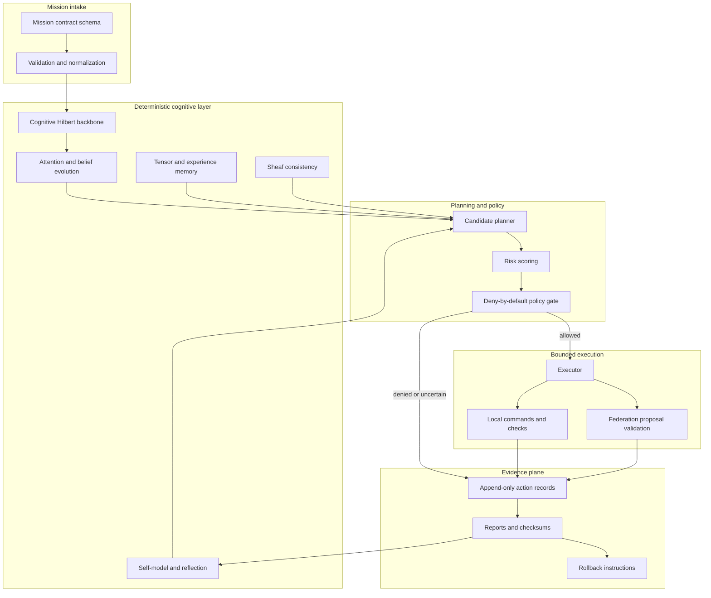
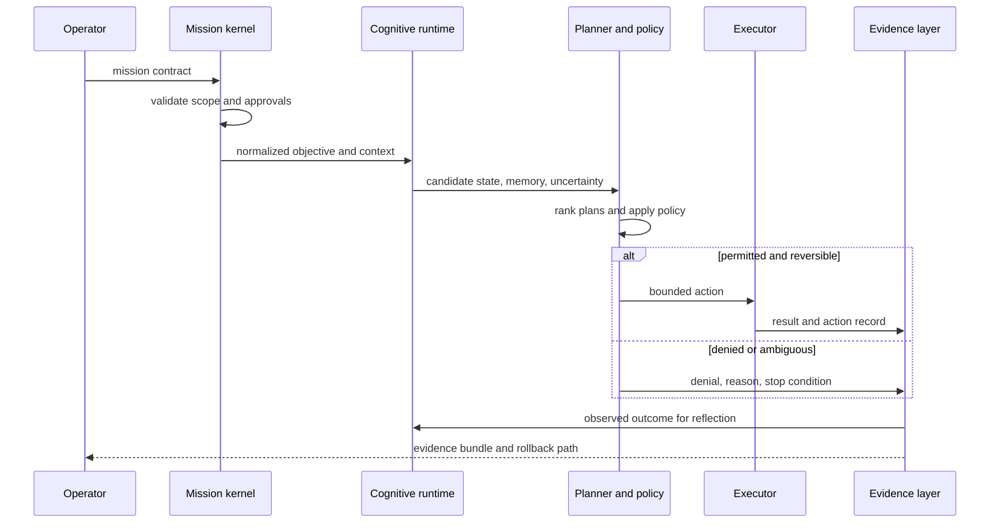

# System architecture

## Architectural intent

Autonomous vNext is a constrained engineering control loop. The design separates cognition and proposal generation from authority to change durable or external state. Each layer produces evidence that can be inspected before a higher-authority transition is attempted.

## Component model

## Runtime sequence

## Trust zones

| Zone | Examples | Default authority |
|---|---|---|
| Z0: static definitions | schemas, policies, architecture documents | readable; changes require review |
| Z1: local observation | repository state, test output, generated reports | read-only unless mission grants bounded local output |
| Z2: local reversible work | scoped source edits, temporary artifacts, patch bundles | allowed only through explicit policy and clean rollback |
| Z3: proposal exchange | federation packets, VTX candidates, cross-repository fixtures | validate and quarantine; not canonical by default |
| Z4: privileged external state | GitHub writes, credentials, secrets, releases, deployments, Terraform apply | denied without a separately approved gateway and human authorization |
| Z5: canonical governance | Repository `1`, release approval, incident authority, emergency stop | outside Repository `0`'s unilateral control |

## Repository surfaces

### Core Python package

`autonomous_vnext/` contains the mission, planning, policy, audit, execution, cognitive-state, memory, consistency, federation, self-model, and reflection primitives. These components are designed to remain deterministic and testable before optional acceleration or remote integrations are introduced.

### Contracts

`mission_contract.schema.json` and `action_record.schema.json` define the current root contracts. Additional VTX, proposal, receipt, capability, and cross-repository schemas remain candidate work unless accepted through the task chain and assigned to a canonical owner.

### Federation surfaces

`FederationInbox/`, `FederationDispatch/`, `FederationRelay/`, and `FederationPatches/` support status, handoff, and patch-first collaboration. Local CLI remains the authoritative integrator in the current model. A remote surface may propose but must not silently apply a patch or treat stale state as current.

### Observability and infrastructure proposals

The merged Gods and Clan scaffolds add portfolio observability and Terraform planning material. Their existence does not grant automatic Jira mutation, Terraform apply, release, deployment, or credential authority. The associated punch list remains part of their acceptance boundary.

## Failure containment

The architecture fails closed when:

- the mission is malformed, ambiguous, or outside scope;
- a command or path is not explicitly permitted;
- the authoritative head differs from the proposal baseline;
- required evidence, credentials, remotes, or approvals are absent;
- a proposal is stale, malformed, replayed, or incompatible;
- tests expose unbounded unrelated failure;
- output cannot be made deterministic or reviewable;
- rollback is missing or cannot restore the last verified state.

A stopped mission should still emit a denial or incident record containing the reason, observed state, evidence captured before stopping, and the safest next action.

## Architectural invariants

1. Cognition does not imply authority.
2. A proposal is not canonical state.
3. Passing tests on one commit do not validate another commit.
4. Evidence must identify the exact source, command, environment, and result.
5. Consequential external actions require a separately defined capability and approval path.
6. Every accepted transition must preserve an observable rollback or compensating action.
7. Repository-specific gates cannot be weakened by a portfolio-level orchestrator.
8. Accelerated development must increase parallel analysis and validation, not reduce provenance or human control over irreversible actions.
