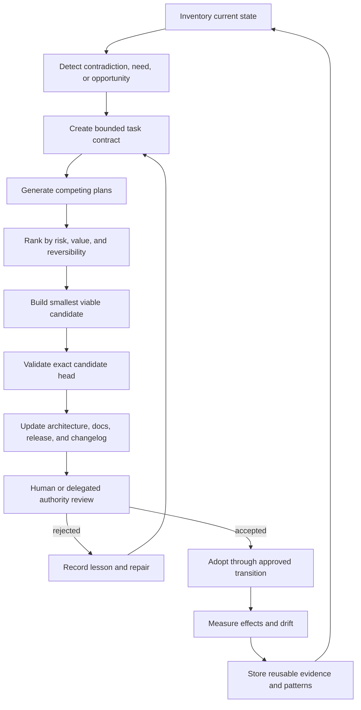

# Autonomous development

## Objective

The autonomous-development loop exists to complete and continuously improve A.L.I.S.T.A.I.R.E. through increasingly efficient, evidence-preserving engineering. Repository `0` should coordinate repeatable planning, implementation proposals, testing, documentation, review preparation, and operational learning across opted-in repositories.

## Capability ladder

Authority should advance only after the preceding level is reproducible and independently reviewable.

| Level | Capability | Required control |
|---|---|---|
| L0 | Read public and approved local state | source identity and data classification |
| L1 | Analyze, plan, and generate documentation | bounded mission and claim discipline |
| L2 | Prepare local patches and tests | isolated branch, clean diff, rollback |
| L3 | Run deterministic validation | exact-head checkout, retained evidence |
| L4 | Prepare pull requests and review packets | scoped credentials, human-visible proposal |
| L5 | Apply low-risk approved maintenance | explicit opt-in, policy gateway, idempotency |
| L6 | Merge selected change classes | repository-specific approval and protected branch rules |
| L7 | Release or deploy selected artifacts | signing, provenance, rollback, incident ownership |
| L8 | Modify its own orchestration policy | independent governance review and emergency stop |

Current documentation does not claim L5-L8 approval. Existing remote, Terraform, portfolio-health, and credential-gateway scaffolds must remain within their documented review boundaries.

## Continuous loop

## Parallel work model

Multiple agents or surfaces may work concurrently when work is partitioned by contract and no two writers silently claim the same authority. Recommended roles include:

- **Architect:** maintains the system map, contracts, ownership, and decisions.
- **Builder:** prepares scoped patches and fixtures.
- **Verifier:** reproduces tests and challenges claims independently.
- **Security reviewer:** evaluates authority, secrets, network, supply chain, and rollback.
- **Documentation steward:** keeps Pages, onboarding, task chain, release, and changelog aligned.
- **Integration steward:** detects cross-repository version and route conflicts.
- **Incident custodian:** preserves failed-candidate evidence and coordinates containment.
- **Release gatekeeper:** confirms exact-head evidence and explicit approval before release.

A role name is not a capability grant. Each run must still identify the actual service identity, repository scope, operation allowlist, expiration, and revocation path.

## Acceleration mechanisms

Development should become faster by compounding trusted assets:

1. reusable schemas and negative fixtures;
2. shared exact-head validation patterns;
3. deterministic evidence manifests;
4. architecture decision records and ownership maps;
5. known-good onboarding environments;
6. incident and rollback playbooks;
7. contract-aware documentation templates;
8. benchmark histories and regression thresholds;
9. local caches and generated artifacts that never replace source identity;
10. measured task outcomes used to improve planning and risk estimates.

## Consequential actions

The following remain independently gated even when planning and validation are automated:

- credential issuance or expansion;
- writes to protected or canonical branches;
- merge and release approval;
- package publication and signing;
- infrastructure apply and destructive changes;
- payment or financial commitment;
- privacy-sensitive publication;
- emergency exceptions;
- changes to policy, capability issuance, audit retention, or emergency stop.

## Self-improvement boundary

Repository `0` may propose changes to its own planner, policy, evidence model, and workflows. Those proposals require the same or stronger controls as changes to another repository. A self-referential improvement must identify the evaluator that remains independent of the modified component, preserve prior policy and artifacts, and demonstrate rollback before adoption.

## Progress measurement

Useful measurements include:

- lead time from detected need to reviewable candidate;
- percentage of candidate heads with complete evidence;
- first-pass validation rate;
- rollback success rate;
- stale-proposal rejection rate;
- unresolved architecture contradictions;
- repeated setup work eliminated through reusable fixtures;
- escaped regressions and incident recovery time;
- proportion of accepted changes with synchronized documentation.

Velocity is not measured by commit count alone. A faster system produces more accepted, reproducible, reversible improvements with fewer repeated errors and less uncertainty.
