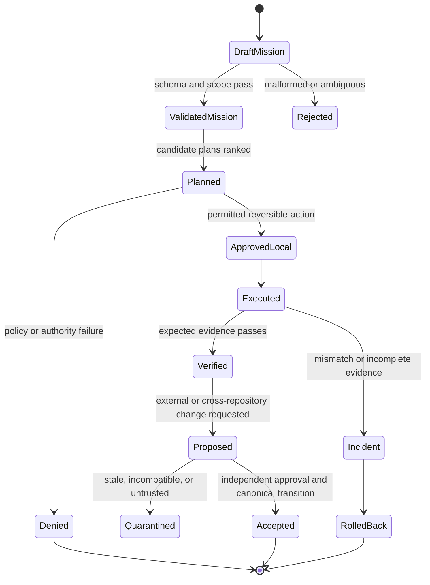

# Contracts and state

## Contract hierarchy

Autonomous vNext treats every consequential action as a transition between explicit states. A transition is eligible only when its input contract, policy decision, evidence, and resulting state can be reviewed together.

## Mission contract

A mission must identify:

- stable mission identifier;
- objective and intended user outcome;
- repository and path boundary;
- success criteria;
- constraints and prohibited actions;
- approval profile;
- expected evidence;
- stop conditions;
- rollback or compensating action;
- creation time and initiating identity.

The current `mission_contract.schema.json` is the implemented root. Additional fields should be introduced through a versioned compatibility decision rather than silently changing meaning.

## Action record

Every attempted action should produce an append-only record containing:

- mission and step identifiers;
- actor and action type;
- normalized command or operation;
- policy decision and reason code;
- exact source revision and relevant input digests;
- start and completion times;
- status and exit information;
- output artifact references and hashes;
- observed side effects;
- rollback status;
- residual risk or follow-up requirement.

Redact secrets before storage. A record should preserve enough structure to reproduce the decision without embedding credentials or sensitive payloads.

## Proposal packet

Cross-surface or cross-repository work should be represented as a proposal rather than an implicit instruction. A complete packet includes:

- source and intended destination;
- authoritative baseline commit;
- proposed branch or partition;
- summary and bounded purpose;
- patch or artifact digest;
- contract and schema versions;
- required capability;
- validation commands and expected results;
- expiration, nonce, and replay information when transport requires them;
- rollback and conflict behavior.

A stale baseline, missing destination owner, absent capability, invalid digest, or incompatible schema places the proposal in quarantine.

## Evidence bundle

A reviewable evidence bundle should include:

| Evidence | Minimum content |
|---|---|
| Source identity | repository, branch, exact commit, dirty-state status |
| Environment | OS, runtime and package-manager versions, relevant configuration |
| Commands | exact commands, ordered execution, exit codes |
| Tests and checks | complete summaries, skipped steps, failures, and logs |
| Artifacts | names, sizes, SHA-256 digests, retention location |
| Policy | decision, rule, capability, approver when applicable |
| Change map | files and contracts changed; scope exclusions |
| Recovery | rollback command or compensating transition and verification |
| Review state | unresolved contradictions, threads, gates, and owner decisions |

## Compatibility rules

1. Contract versions are explicit and immutable after release.
2. Unknown required fields fail closed.
3. Optional fields must not change the meaning of existing required fields.
4. Writers declare the version emitted; readers declare accepted versions.
5. Migrations are deterministic, testable, reversible where possible, and owned.
6. Cross-repository fixtures include positive, negative, stale, replayed, malformed, and version-skew cases.
7. Human-readable documentation and machine-readable schemas must be changed together.

## State ownership

Repository `0` owns local mission and evidence state generated within its approved workspace. It does not automatically own the canonical state of another repository, credentials, releases, deployments, external issue systems, or infrastructure. Those transitions require an accepted contract with the designated owner and an independently enforceable capability boundary.
