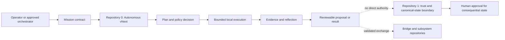

# Autonomous vNext

Repository `0` is the bounded autonomous-development and proposal layer for the A.L.I.S.T.A.I.R.E. ecosystem. Its present implementation turns an explicit mission into a low-risk plan, policy decision, bounded local action, evidence record, and reviewable result while preserving human control over credentials, remote writes, merging, release, deployment, and rollback.

!!! warning "Release status"
    The repository is not release-ready. The active product objective remains one reproducible, policy-gated, reversible local mission verified at one immutable commit. Portfolio governance, VTX publication authority, remote credential gateways, scientific domain engines, and automatic infrastructure changes remain separate proposals or guarded capabilities.

## Primary outcome

An operator provides a mission contract with an objective, constraints, success criteria, repository boundary, and approval profile. Autonomous vNext then:

1. validates the mission;
2. observes relevant local state;
3. produces bounded candidate plans;
4. scores risk and applies deny-by-default policy;
5. executes only permitted local checks or reversible actions;
6. records structured action and evidence artifacts;
7. compares expected and observed results;
8. stops, rolls back, or proposes follow-up work when the approved envelope is exceeded.

## System position

Repository `0` may prepare, validate, score, and evidence proposals. It does not silently acquire credentials, make itself authoritative over Repository `1`, merge arbitrary changes, publish releases, deploy infrastructure, or bypass repository-specific gates.

## Implemented capability groups

| Group | Current responsibility |
|---|---|
| Mission and action contracts | Define explicit intake and append-only action records |
| Planner and risk model | Generate candidates and prefer the lowest-risk viable plan |
| Policy and executor | Deny unapproved commands, paths, network access, secrets, and remote actions |
| Evidence and audit | Record structured outputs, exact inputs, decisions, and rollback information |
| Cognitive runtime | Run deterministic projection, attention, belief, uncertainty, memory, consistency, and reflection primitives |
| Federation | Exchange status and patch proposals while retaining Local CLI as the authoritative integrator |
| Portfolio observability | Provide bounded health and evidence proposals; automated owner-wide authority remains separately gated |
| Gods and Clan integration | Expose observability and Terraform planning scaffolds while preserving approval for apply, release, and deployment |

## Documentation map

- [System architecture](architecture.md) — components, trust zones, data flows, and failure containment.
- [A.L.I.S.T.A.I.R.E. role](alistaire-role.md) — portfolio ownership and subsystem relationships.
- [Contracts and state](contracts.md) — mission, action, proposal, evidence, and compatibility rules.
- [Autonomous development](autonomous-development.md) — acceleration loop, authority ladder, and acceptance sequence.
- [Developer onboarding](development.md) — setup, validation, repository map, and change discipline.
- [Operations and recovery](operations.md) — routine execution, incident handling, rollback, and handoff.
- [Security and authority](security.md) — protected assets, policy boundaries, credentials, and stop conditions.
- [Release evidence](release-evidence.md) — exact-head validation and release gate requirements.

## Canonical planning sources

Documentation must remain consistent with the repository root:

- `taskchain.md` controls current priority and stop conditions;
- `release.md` controls release eligibility, exclusions, evidence, and rollback;
- `changelog.md` records accepted and candidate changes;
- `AUTONOMOUS_VNEXT.md` defines the implemented constrained-agent model;
- `punchlist.md` and focused punch lists record incomplete evidence and review work.

When these sources disagree, do not silently select the most permissive interpretation. Record the contradiction and stop consequential work until the owner is designated and the decision is documented.

## Non-goals

This documentation does not authorize unrestricted self-modification, autonomous credentials, silent pushes, destructive Git operations, production scientific claims, physical quantum-computing claims, automatic Terraform apply, automatic release, or deployment. Increasing development velocity is achieved through parallel proposal generation, deterministic validation, evidence reuse, and bounded automation—not by removing traceability or recovery paths.
