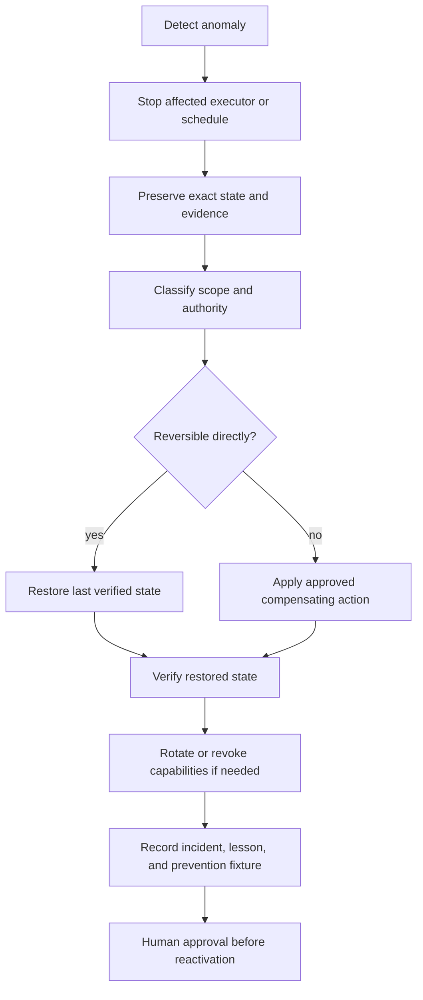

# Operations and recovery

## Operating posture

Autonomous vNext is operated as a proposal-first, evidence-first system. Routine work should be local, reversible, and tied to an explicit mission. Remote or cross-repository actions require a separately approved capability and must never be inferred from the existence of a script, workflow, adapter, or integration scaffold.

## Routine local cycle

1. Confirm repository, branch, exact head, and clean/dirty state.
2. Read the current task chain and applicable punch list.
3. Validate mission objective, constraints, approvals, and rollback.
4. Run the smallest read-only inventory required.
5. Generate candidate plan and policy decision.
6. Execute only allowed local work.
7. Run focused and complete applicable validation.
8. write action records, reports, hashes, and reflection output;
9. prepare a patch or pull request rather than mutating canonical state directly;
10. retain failed and successful evidence according to the release plan.

## Federation operations

The federation utilities support status, dispatch, relay, and patch-first collaboration across Local CLI, browser, desktop, mobile, and bridge surfaces. The current operational rule is:

- Local CLI is the authoritative integrator;
- nonlocal surfaces report status, observations, or patch proposals;
- proposals bind to an authoritative commit;
- stale or malformed packets are rejected or quarantined;
- patch application is a distinct reviewed action;
- runtime reports may be pruned only through the documented archive/delete modes;
- contact evidence describes an attempted handoff, not proof of completed remote work.

## Portfolio-health operations

Owner-wide health scanning is a separate governance capability. A trusted schedule must run reviewed code from its approved branch, enumerate only opted-in repositories, distinguish current heads from superseded failures, fail closed on access errors, and avoid automatic merge, release, rerun, or issue closure unless those actions are separately authorized.

Draft PR #10 is the current repaired portfolio-health candidate. Its successful candidate checks establish a reviewable implementation proposal, not acceptance of credentials, schedules, issue lifecycle, or release authority.

## Gods and Clan operations

The merged Gods and Clan scaffolds provide portfolio metrics, Jira synchronization concepts, and Terraform governance material. Operational limits remain:

- monitoring and planning may be automated within approved read scopes;
- Jira mutation requires designated credentials and lifecycle policy;
- Terraform plan and policy checks are distinct from apply;
- infrastructure apply, release, and deployment remain human-approved;
- workflow pinning, credentials, and exact-head evidence remain governed by `punchlists/gods-clan-pre-review.md`.

## Incident classes

| Class | Example | Immediate response |
|---|---|---|
| Source drift | branch or head differs from reviewed candidate | stop; capture state; rebase or rebuild candidate deliberately |
| Policy bypass | command, path, network, or credential action escapes rules | stop execution; revoke capability; preserve logs; inspect affected state |
| Evidence gap | missing logs, hashes, exact head, or skipped validation | treat result as unverified; do not promote |
| Stale proposal | packet baseline no longer matches authority | quarantine and request refreshed proposal |
| Contract conflict | repositories disagree on route or schema semantics | stop cross-repository transition; assign owner and ADR |
| Credential exposure | secret appears in logs, artifacts, repository, or UI | revoke/rotate; restrict access; preserve redacted incident evidence |
| External mutation | unexpected issue, branch, release, deployment, or infrastructure change | disable writer; snapshot state; identify identity and operation; roll back or compensate |
| Repeated automation failure | retry loop, duplicate issue, or non-idempotent action | disable schedule; restore checkpoint; repair before reactivation |

## Recovery sequence

## Rollback requirements

Every accepted candidate should identify:

- last verified commit or tag;
- files, schemas, state, workflows, and external systems changed;
- commands to revert or restore;
- generated artifacts that must be removed or regenerated;
- credential or schedule disablement sequence;
- database, issue, release, or infrastructure compensating action when direct rollback is impossible;
- verification commands and expected restored state;
- retained evidence location.

## Emergency stop

The portfolio needs one documented emergency-stop authority spanning Repository `0`, Repository `1`, workflow schedules, credential gateways, infrastructure adapters, and release/deployment systems. Until that mechanism is accepted, operators must be able to disable each component independently and should avoid coupling recovery to the failing automation itself.
