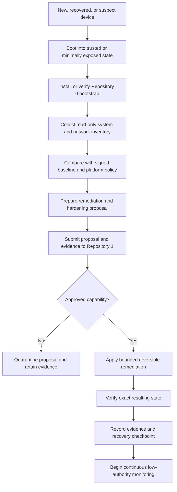

# Portable First-Install Security Role

## Mission

Repository `0` and Repository `1` form the first security and control layer installed on a newly acquired, replaced, recovered, or potentially compromised device. Their combined purpose is to establish a known, reviewable baseline before higher-level A.L.I.S.T.A.I.R.E. services, developer tools, package managers, network integrations, or user workloads are trusted.

Typical triggers include:

- a laptop, phone, or workstation is lost, stolen, replaced, reset, or reimaged;
- a new operating environment must be brought under known control;
- package managers such as Homebrew, shell environments, startup agents, extensions, or local services must be inventoried before use;
- Wi-Fi, hotspot, Bluetooth, DNS, proxy, VPN, routing, tethering, firewall, and sharing settings must be inspected for unauthorized redirection or persistence;
- the user needs a portable, repeatable recovery path that does not depend on the previous device remaining available.

## Repository `0` responsibility

Repository `0` is the candidate **portable bootstrap, inspection, remediation-planning, and autonomous maintenance orchestrator**. It may:

1. identify the host platform and supported security baseline;
2. inventory installed packages, startup mechanisms, services, profiles, browser extensions, network interfaces, Bluetooth state, sharing features, and configured routes;
3. compare observed state with an approved baseline;
4. prepare reversible remediation plans and isolated changes;
5. run bounded verification and collect evidence;
6. submit proposals to Repository `1` for approval or canonical recording;
7. monitor approved invariants after installation.

Repository `0` does not become authoritative merely because it detects an issue or prepares a fix. It must not discover credentials, self-authorize privileged changes, disable protections, or silently alter protected state.

## Bootstrap sequence

## Baseline domains

The portable baseline should eventually define platform-specific, testable controls for:

- operating-system version, secure boot, disk encryption, screen lock, update policy, and recovery configuration;
- local accounts, administrative groups, authentication methods, keychains, credential stores, and remote-login services;
- package managers, package sources, shell initialization files, environment variables, launch agents, scheduled jobs, daemons, and system extensions;
- firewall, DNS, proxy, VPN, routes, packet forwarding, hotspot, tethering, internet sharing, AirDrop or nearby sharing, Bluetooth pairing, and network-interface state;
- browser extensions, trusted certificates, device-management profiles, developer certificates, and local trust stores;
- backups, recovery keys, evidence export, and emergency restore points;
- approved A.L.I.S.T.A.I.R.E. repositories, commit identities, dependency locks, and documentation hashes.

The precise controls differ by macOS, Linux, Windows, Android, iOS, and constrained environments. Unsupported controls must be reported as `UNKNOWN` rather than assumed secure.

## Security posture

Repository `0` follows these principles:

- **read first** — inventory before remediation;
- **offline where practical** — minimize exposure until baseline checks complete;
- **deny by default** — unknown external services, routes, profiles, and persistent agents do not receive trust automatically;
- **reversible change** — every remediation has a checkpoint and rollback path;
- **evidence before trust** — package, configuration, and network state are recorded and compared with approved expectations;
- **platform honesty** — no claim of control is made where the platform prevents inspection or enforcement;
- **human visibility** — consequential changes remain reviewable and explainable.

## Boundary with Repository `1`

Repository `0` performs observation, analysis, planning, bounded execution, and verification. Repository `1` owns the candidate canonical baseline, capability grants, approvals, revocations, recovery checkpoints, and authoritative receipts. The cross-repository route begins when Repository `0` emits a versioned proposal and evidence envelope for admission into Repository `1` quarantine.

## Non-goals

This role does not imply:

- guaranteed detection of every compromise;
- unrestricted monitoring, interception, exploitation, or counter-intrusion;
- bypassing operating-system security controls;
- taking control of devices not owned or explicitly authorized by the user;
- silently deleting software, profiles, accounts, certificates, or evidence;
- treating unusual network behavior as proof of a particular attacker;
- activating privileged remediation before the applicable capability and approval exist.

## Required next documentation

- platform support matrix and minimum trusted bootstrap assumptions;
- signed baseline schema and policy versioning;
- inventory and evidence-envelope schemas;
- macOS/Homebrew/network/Bluetooth/hotspot reference baseline;
- mobile-platform limitations and recovery workflows;
- quarantine, rollback, and clean-room reinstall decision trees;
- shared fixtures proving Repository `0` proposals glue correctly to Repository `1` authority decisions.
