# Release evidence

## Release posture

The first eligible Autonomous vNext release should demonstrate a trustworthy bounded mission, not broad autonomous authority. Documentation, tests, workflows, and artifacts are evidence only when they apply to the exact immutable candidate under review.

## Evidence pipeline

```mermaid
flowchart LR
    C[Candidate exact head] --> I[Identity assertion]
    I --> E[Clean environment]
    E --> T[Static, unit, integration, and smoke checks]
    T --> S[Security and authority validation]
    S --> D[Strict documentation build]
    D --> R[Rollback exercise]
    R --> P[Provenance and checksums]
    P --> H[Explicit human approval]
    H --> G[Tag, release, or deploy through approved channel]
```

## Minimum exact-head record

- repository and candidate branch;
- base and submitted head commit;
- workflow event and run identifier;
- checkout assertion proving the tested head;
- operating system and runtime versions;
- dependency manifests, lockfiles, installed versions, and SBOM where applicable;
- ordered commands, exit codes, skipped steps, and complete logs;
- test and coverage reports;
- mission, action, evidence, policy, and rollback fixtures;
- generated documentation artifact;
- SHA-256 manifest covering retained evidence;
- unresolved review threads, contradictions, and exclusions;
- approver and approval decision.

## Gate matrix

| Gate | Passing evidence |
|---|---|
| Repository health | complete language, package, manifest, workflow, hook, runtime, generated-output, and deployment inventory |
| Environment | clean setup works from documented commands without undeclared local state |
| Core tests | all applicable tests pass; failures and skips are explained |
| Bounded mission | one mission produces plan, policy, execution result, evidence, reflection, and rollback |
| Policy | prohibited command, path, network, secret, stale proposal, and excessive authority cases fail closed |
| Federation | valid proposals are reproducible; stale, malformed, replayed, and incompatible packets are rejected |
| Documentation | `mkdocs build --strict` passes and local links resolve |
| Security | permissions, credentials, supply chain, network, artifacts, and incident controls are reviewed |
| Recovery | rollback restores the recorded prior state and is independently verified |
| Provenance | source archive, dependencies, generated artifacts, checksums, and attestations bind to the candidate |
| Approval | authorized human explicitly approves the exact head and scope |

## Candidate versus accepted state

Use these terms precisely:

- **implemented:** code or documentation exists;
- **configured:** a setting or workflow is present;
- **tested:** a named check ran against a stated revision;
- **validated:** required checks and evidence satisfy the defined gate;
- **approved:** the designated authority accepted the candidate and residual risks;
- **released:** an immutable artifact or tag was published through the approved process;
- **deployed:** the approved artifact is operating in an identified environment.

No earlier state implies a later state.

## Current candidate boundaries

- PR #7 remains a stale/non-mergeable P0 inventory path without successful exact-head evidence for its current head.
- PR #10 is the repaired portfolio-health control-plane candidate with successful exact-head candidate checks, but it remains draft pending governance, credential, issue-lifecycle, and trusted-main review.
- PR #11 merged Gods and Clan scaffolding with recorded pre-review hardening work and no automatic apply/release authority.
- PR #12 merged the source comment-style policy.
- PR #6 remains a draft cross-repository/VTX proposal and is excluded from the first bounded-mission release.

These facts must be rechecked at review time; this page does not turn a draft, merged scaffold, or passing structural workflow into release approval.

## Documentation artifact

The documentation workflow should:

1. check out and assert the exact submitted head;
2. install only pinned documentation dependencies;
3. run strict MkDocs rendering;
4. validate required planning documents and local Markdown links;
5. create a deterministic site archive and evidence manifest;
6. upload retained evidence without publishing or changing repository state.

Pages publication should be a separately approved job or repository setting after the documentation candidate is merged and accepted.

## Rollback evidence

A release candidate is incomplete until rollback has been executed or safely simulated against representative state. Record the starting state, transition, rollback command or compensating action, restored state, verification result, elapsed time, and any irreversible residue.
